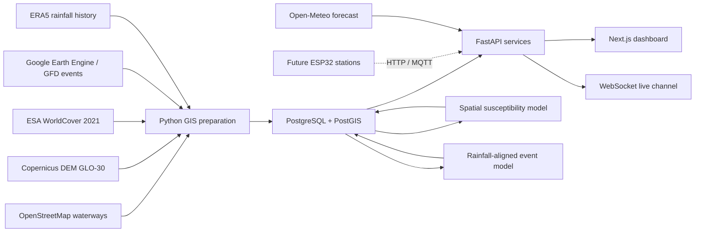

# Geo AI Floating Project — လက်ရှိအခြေအနေနှင့် ဆက်လက်လုပ်ဆောင်ရန် Roadmap

နောက်ဆုံးအတည်ပြုရက်: **2026-08-03**  
Project area: **Maubin Township, Ayeyarwady Region (`MMR017019`)**  
Project UI name: **DeltaWatch / FloodGuard Myanmar**  
လက်ရှိအဆင့်: **Historical flood intelligence MVP — operational forecast မဟုတ်သေး**

ဤစာတမ်းသည် repository code၊ live FastAPI OpenAPI၊ PostGIS records၊ migrations၊
model artifacts နှင့် test results ကိုအခြေခံထားသည့် လက်ရှိ authoritative status
ဖြစ်သည်။ Root `README.md` ထဲရှိ အစောပိုင်း architecture/technology အချို့သည်
အစီအစဉ်ရေးဆွဲစဉ်က ရည်မှန်းချက်များဖြစ်ပြီး လက်ရှိ implementation နှင့်
တိတိကျကျမတူနိုင်သည်။

## 1. Executive summary

Project သည် Maubin Township အတွက် geospatial data များကို စုစည်း၊ PostGIS ထဲ
သိမ်းဆည်း၊ historical flood susceptibility နှင့် historical event hindcast များ
တွက်ချက်ပြီး 2D/3D/Cesium map များပေါ်တွင် ရှင်းလင်းပြသနိုင်သည့်အဆင့်သို့
ရောက်ရှိပြီးဖြစ်သည်။

လက်ရှိ system က အောက်ပါမေးခွန်းများကို ဖြေဆိုနိုင်သည်။

- Maubin အတွင်း မြေနိမ့်၊ ရေလမ်းနီး၊ ပြန့်ပြူးသည့် terrain cells များ ဘယ်မှာရှိသလဲ။
- Historical satellite records အရ ဘယ်နေရာများ ရေဖုံးလွှမ်းဖူးသလဲ။
- Historical evidence အားလုံးပေါင်းစပ်လျှင် ဘယ် cells များ flood-susceptible
  ပိုဖြစ်သလဲ။
- Held-out historical flood event တစ်ခုကို rainfall-aligned model က
  ဘယ်လို hindcast လုပ်ခဲ့သလဲ။
- Model probability၊ observed flooded fraction၊ model version နှင့် test metrics
  ကို audit လုပ်နိုင်သလား။

လက်ရှိ system က အောက်ပါမေးခွန်းများကို မဖြေဆိုနိုင်သေးပါ။

- မနက်ဖြန် သို့မဟုတ် နောက် ၆ နာရီအတွင်း တကယ်ရေကြီးမည်လား။
- ရေအနက် ဘယ်လောက်ဖြစ်မလဲ။
- ရေဘယ်အချိန်ရောက်မလဲ၊ ဘယ်နေရာအရင်မြုပ်မလဲ။
- လက်ရှိမြစ်ရေတက်နှုန်း၊ tide၊ levee breach သို့မဟုတ် drainage capacity အရ
  operational warning ထုတ်သင့်သလား။

## 2. Status at a glance

| အပိုင်း | Status | လက်ရှိအခြေအနေ |
|---|---|---|
| FastAPI backend | ပြီး | Versioned REST APIs၊ validation၊ structured errors၊ Swagger |
| PostgreSQL + PostGIS | ပြီး | Spatial/vector/raster/time-series/model records |
| Maubin boundary | ပြီး | Township boundary 1 ခု |
| OSM waterways | ပြီး | River segments 282၊ canal segments 21 |
| 30 m DEM terrain pipeline | ပြီး | 5,549 township-clipped 500 m cells |
| ESA WorldCover | ပြီး | Terrain cells အားလုံး land-cover shares ပါရှိ |
| ERA5 rainfall history | ပြီး | 9,497 daily rows၊ 2000-01-01 မှ 2025-12-31 |
| Weather forecast | ပြီး | Open-Meteo 1–7 day rainfall forecast API/UI |
| GFD flood frequency | ပြီး | 2000–2018 aggregate frequency groups 1–8 |
| Individual GFD events | ပြီး | Maubin နှင့်ထိသော events 17 ခု |
| Terrain screening | ပြီး | Explainable rule-based relative score |
| Spatial susceptibility ML | ပြီး/experimental | 5,549 probabilities၊ spatial holdout metrics |
| Rainfall-aligned event ML | ပြီး/experimental | 94,333 rows၊ chronological holdout၊ calibrated threshold |
| Historical event hindcast map | ပြီး/experimental | Event selector ပါသော 2D/3D/Cesium layer |
| Sensor APIs/MQTT/WebSocket | API-ready | Physical sensor မရှိသေး |
| Threshold alert workflow | API-ready | Real station data မရှိသေး |
| Live flood forecast | မပြီးသေး | Forecast-run inference contract မရှိသေး |
| Flood depth/arrival time | မပြီးသေး | Hydraulic data/model လိုအပ် |
| Authentication/authorization | မပြီးသေး | Local MVP endpoints unauthenticated |
| Production deployment | မပြီးသေး | Hosting၊ secrets၊ CI/CD၊ monitoring လိုအပ် |

## 3. လက်ရှိ architecture



Architecture ပုံစံသည် local hackathon MVP အတွက် modular monolith ဖြစ်သည်။
Backend API၊ data services၊ ML scripts နှင့် PostGIS တို့ကို တစ်နေရာတည်းတွင်
စီမံထားပြီး frontend ကို သီးခြား Next.js application အဖြစ်ထားသည်။

## 4. လက်ရှိအမှန်တကယ်အသုံးပြုထားသော technology stack

| Layer | Actual implementation |
|---|---|
| Frontend | Next.js 16.2.12, React 19.2.4, TypeScript |
| 2D map | Leaflet 1.9.4, React-Leaflet 5 |
| Regional 3D map | MapLibre GL JS 5.24 |
| Globe/terrain map | CesiumJS 1.143 |
| Backend | Python, FastAPI, Pydantic, SQLAlchemy 2 |
| Database | PostgreSQL, PostGIS, PostGIS Raster |
| Migrations | Alembic, current head `20260803_0014` |
| GIS processing | Shapely, GeoAlchemy2, PyProj, Rasterio/GDAL workflows |
| Current ML | Dependency-light NumPy regularized logistic regression |
| Weather/rainfall | Open-Meteo forecast and ERA5 archive |
| Messaging | HTTP ingestion, MQTT bridge, WebSocket broadcast |

လက်ရှိ model တွင် Scikit-learn၊ XGBoost သို့မဟုတ် LSTM မသုံးထားသေးပါ။
၎င်းတို့သည် နောက်အဆင့် model comparison/deep time-series အတွက် candidates များသာ
ဖြစ်သည်။

## 5. Data inventory နှင့် provenance

### 5.1 Maubin boundary

- Source: MIMU Township Boundary 2020 copy served by UNOSAT
- CRS: WGS84 / EPSG:4326
- Current records: township boundary 1 ခု
- အသုံးပြုမှု: clipping၊ map outline၊ terrain/grid extent
- အရေးကြီး limitation: online/public platform အသုံးပြုမှုအတွက် MIMU prior written
  agreement လိုအပ်နိုင်သည်။ Public launch မတိုင်မီ licence ကိုအတည်ပြုရန်လိုသည်။

### 5.2 OpenStreetMap waterways

- River segments: **282**
- Canal segments: **21**
- Township boundary ဖြင့် clip လုပ်ပြီး monitoring-friendly segments ခွဲထားသည်။
- Community mapping ဖြစ်သောကြောင့် local drains/embankments မပြည့်စုံနိုင်သည်။
- ODbL attribution/terms ကိုဆက်လက်ထိန်းသိမ်းရမည်။

### 5.3 Copernicus DEM GLO-30

- Raw resolution: approximately 30 m
- လက်ရှိ analysis/display grid: **500 m terrain cells 5,549 ခု**
- Cell attributes:
  - minimum/mean/maximum elevation
  - elevation standard deviation
  - local relief
  - township elevation percentile
  - mapped waterway distance
- GLO-30 သည် DSM ဖြစ်၍ bare-earth survey DEM မဟုတ်ပါ။ Maubin လို relief နည်းသော
  နေရာတွင် centimetre-level drainage/levee behavior ကိုမဖော်ပြနိုင်ပါ။

### 5.4 ESA WorldCover 2021 v200

- Raw resolution: 10 m
- Reference year: 2021
- Terrain cell တစ်ခုစီတွင် class percentages နှင့် dominant class သိမ်းထားသည်။
- Classes include tree, shrub, grass, cropland, built-up, bare, permanent water,
  wetland and mangrove.
- Historical flood events အချို့ထက် reference year နောက်ကျသောကြောင့် temporal
  mismatch ရှိသည်။

### 5.5 ERA5 rainfall history

- Daily rows: **9,497**
- Coverage: **2000-01-01 to 2025-12-31**
- Maubin ထိသော ERA5 grid cells 8 ခုကို area-weighted aggregate လုပ်ထားသည်။
- Features:
  - daily mean/max/p90 rainfall
  - 3-day accumulation
  - 7-day accumulation
  - 30-day accumulation
- Township-level coarse reanalysis ဖြစ်၍ village/station rainfall မဟုတ်ပါ။

### 5.6 Global Flood Database (GFD)

- Dataset: `GLOBAL_FLOOD_DB/MODIS_EVENTS/V1`
- Temporal coverage: 2000–2018
- Aggregate frequency records: 8 non-empty classes
- Individual Maubin-overlap events: **17**
- Export rectangle ထဲရှိသော်လည်း township မထိသော events 6 ခုကို importer က
  မှန်ကန်စွာ skip လုပ်ခဲ့သည်။
- Permanent JRC water ကို export stage တွင်ဖယ်ထားသည်။
- MODIS-derived water classifications သည် vegetation၊ built-up area၊ clouds နှင့်
  250 m processing scale ကြောင့် omissions/false detections ဖြစ်နိုင်သည်။
- Licence: CC BY-NC 4.0; commercial/public deployment မတိုင်မီ terms ပြန်စစ်ရမည်။

## 6. ပြီးစီးထားသော backend capabilities

### 6.1 Application foundation

- FastAPI application နှင့် `/docs` Swagger UI
- `/health` နှင့် `/api/v1/health`
- Environment-driven configuration
- CORS allowlist
- Structured validation/error envelopes နှင့် request IDs
- SQLAlchemy sessions and models
- PostGIS/PostGIS Raster migrations
- UUID primary keys၊ JSONB metadata၊ timestamps
- GeoJSON Feature/FeatureCollection responses

### 6.2 Generic spatial assets

- Create/list/read/update/delete GeoAsset APIs
- Asset type filtering and pagination
- WGS84 bounding-box intersection query
- Atomic prepared-GeoJSON bulk import
- Stable `source_key` upsert behavior
- Geometry validity/range/type validation

### 6.3 Terrain screening

Rule-based `terrain-screening-v1` သည် sensor မရှိသေးချိန်တွင် priority screening
အတွက်သုံးသည်။

| Factor | Weight |
|---|---:|
| Lower relative elevation | 55% |
| Proximity to mapped waterways | 30% |
| Lower local relief / flatness | 15% |

Output သည် 0–100 relative score နှင့် `LOWER`, `MODERATE`, `HIGH`, `VERY_HIGH`
band ဖြစ်သည်။ Flood probability၊ depth သို့မဟုတ် arrival order မဟုတ်ပါ။

### 6.4 Historical flood evidence

- Provenance-aware `flood_extents` table
- Aggregate frequency နှင့် individual event identity/date range နှစ်မျိုးလုံး
- Geometry repair၊ dissolve၊ township clip၊ geodesic area calculation
- Stable event source keys
- Field-validation flag၊ confidence၊ source URL၊ licence၊ metadata

### 6.5 Weather and rainfall

- Server-side Open-Meteo forecast integration
- 10-minute forecast cache
- Structured provider-failure response
- ERA5 daily history API
- Recent 30/90/366-day dashboard views
- Synthetic weather/sensor reading မဖန်တီးခြင်း

### 6.6 Sensor-ready interfaces

Physical sensor မတပ်ရသေးသော်လည်း အောက်ပါ software foundation ပြီးထားသည်။

- Station registration API
- HTTP/ESP32 reading ingestion
- MQTT bridge with configurable broker/topic/QoS/TLS
- Duplicate protection
- Quality status
- Latest and historical readings APIs
- In-process WebSocket broadcast
- Warning/danger/critical station thresholds
- Immutable alerts and acknowledgement workflow
- Preview-safe sensor simulator

Sensor မရှိသေးသဖြင့် dashboard တွင် real reading မရသေးသည့်နေရာကို `Awaiting data`
ဟုသာပြသည်။ Fake live values မထည့်ထားပါ။

## 7. Machine-learning models

### 7.1 Spatial historical susceptibility baseline

ရည်ရွယ်ချက်: Historical flood evidence နှင့် static geospatial features အရ
ဘယ် terrain cells များ flood-susceptible ပိုဖြစ်သလဲကို rank/probability ပြခြင်း။

Dataset:

- Rows: **5,549 terrain cells**
- Target: cell area 10% နှင့်အထက် historical flood polygon ဖြင့်ဖုံးလွှမ်းခြင်း
- Features:
  - DEM statistics
  - elevation percentile
  - local relief
  - waterway distance
  - WorldCover class shares
- Split: deterministic spatial blocks

Spatial test metrics:

| Metric | Result |
|---|---:|
| Accuracy | 0.7108 |
| Precision | 0.7970 |
| Recall | 0.7015 |
| F1 | 0.7462 |
| ROC-AUC | 0.7782 |
| PR-AUC | 0.8111 |
| Brier score | 0.2038 |

PostGIS တွင် model record 1 ခုနှင့် cell predictions **5,549** ခုရှိသည်။

အဓိပ္ပာယ်: historical susceptibility ဖြစ်သည်။ Current rainfall၊ current river stage
သို့မဟုတ် future forecast ကိုမထည့်ထားသောကြောင့် operational forecast မဟုတ်ပါ။

### 7.2 Rainfall-aligned historical event model (v2 baseline → v5)

ရည်ရွယ်ချက်: Individual historical event တစ်ခု၏ rainfall conditions နှင့် static
terrain/land-cover features ကိုပေါင်းပြီး event-cell flooding ကို hindcast လုပ်ခြင်း။

Dataset:

- Individual events: **17**
- Total rows: **94,333 event × cell rows**
- Features: static features + rainfall + engineered rainfall×terrain interactions
- Chronological split:
  - train: 11 events / 61,039 rows
  - validation: 3 events / 16,647 rows
  - test: latest 3 events / 16,647 rows

Operating policy (v3–v5):

- `screening` — validation recall maximize (precision floor)
- `balanced` — validation F1 maximize
- `conservative` — validation precision maximize (recall floor)
- Thresholds are selected on validation only; test is never used for selection
- v5: `flood_excess` labels (inundation beyond permanent water), land-cover
  fraction normalization, and permanent-water temper β selected on validation

#### Baseline (v2/v3, flood_extent, balanced @ 0.55)

| Metric | Result |
|---|---:|
| Precision | **0.1664** |
| Recall | 0.3941 |
| F1 | 0.2340 |
| ROC-AUC | 0.7244 |
| False positives | 2,424 |

#### Latest v5 (flood_excess labels — not 1:1 comparable)

| Mode | Precision | Recall | Notes |
|---|---:|---:|---|
| balanced (best precision) | 0.1294 | 0.1673 | Best mode for precision |
| conservative (default) | 0.0545 | 0.6833 | High recall, many FPs |
| screening | 0.0909 | 0.0020 | Degenerate on this holdout |

Rolling-origin CV (14 folds, conservative mean precision): **0.040**

**Honest outcome:** evaluation + false-alarm controls shipped; **precision did not
beat 16.6%**. See `docs/MODEL_CARD_FLOOD_EVENT.md`.

Evaluation surfaces:

- `GET /api/v1/flood-ml/event-models/evaluation`
- Dashboard Event hindcast → Error map (TP/FP/FN)
- Retrain: `uv run python -m scripts.train_flood_event_model`

Top model features (v5):

1. 7-day rainfall accumulation
2. Tree-cover percentage
3. Water percentage
4. Rainfall intensity ratio

PostGIS တွင် latest model `maubin-flood-event-logistic-v5` နှင့် validation/test
hindcast predictions ရှိသည်။

အဓိပ္ပာယ်: discrimination signal ရှိသော်လည်း precision နိမ့်ပြီး false alarms
များသေးသည်။ Dashboard မှာ `Experimental historical hindcast` ဟုသာပြထားသည်။
Future forecast သို့မဟုတ် public warning အဖြစ်မသုံးရ။

## 8. Frontend/dashboard ပြီးစီးထားသော features

### 8.1 Map engines

- Leaflet 2D map: pan၊ zoom၊ click inspection
- MapLibre regional 3D: pitch၊ rotate၊ zoom၊ fullscreen၊ vertical exaggeration
- CesiumJS globe: WGS84 globe၊ streamed terrain၊ satellite/street basemap switch၊
  orbit/tilt/zoom

### 8.2 Available map layers

| Layer | အဓိပ္ပာယ် | မဆိုလိုသည့်အရာ |
|---|---|---|
| Elevation | DEM-derived terrain height | Flood probability မဟုတ် |
| Susceptibility | Explainable relative terrain score | Guaranteed arrival order မဟုတ် |
| ML probability | Static historical susceptibility model | Live/future forecast မဟုတ် |
| Event hindcast | Held-out historical event prediction | Operational warning မဟုတ် |
| Land cover | ESA WorldCover dominant class | Current flood water မဟုတ် |
| Waterways | OSM river/canal network | Complete drainage survey မဟုတ် |
| Historical flood | GFD satellite-observed labels | Current inundation မဟုတ် |

### 8.3 Event hindcast UI

- Validation/test historical event selector
- Probability color bands
- Selected event ID/date/split
- Cell probability and calibrated threshold
- Predicted flagged/not-flagged state
- Observed flooded fraction
- Test ROC-AUC၊ precision၊ recall
- Model version and explicit experimental status
- 2D၊ MapLibre 3D နှင့် CesiumJS တို့တွင်တူညီသော overlay

### 8.4 Other dashboard panels

- Backend/PostGIS health
- Rainfall forecast
- ERA5 rainfall history chart
- Terrain/land-cover inspector
- Model metrics and provenance
- Sensor stations/readings state
- Open alerts and acknowledgement state
- MQTT and WebSocket connection status
- Data-layer source/licence/quality information

## 9. Current API inventory

Swagger UI: <http://127.0.0.1:8000/docs>

### Health

- `GET /health`
- `GET /api/v1/health`

### Geo assets

- `POST /api/v1/geo-assets`
- `GET /api/v1/geo-assets`
- `POST /api/v1/geo-assets/import`
- `GET /api/v1/geo-assets/within-bounds`
- `GET /api/v1/geo-assets/{asset_id}`
- `PATCH /api/v1/geo-assets/{asset_id}`
- `DELETE /api/v1/geo-assets/{asset_id}`

### Flood screening and ML

- `GET /api/v1/flood-screening/terrain`
- `GET /api/v1/flood-screening/terrain/index`
- `GET /api/v1/flood-screening/land-cover/summary`
- `GET /api/v1/flood-ml/models/latest`
- `GET /api/v1/flood-ml/predictions/index`
- `GET /api/v1/flood-ml/event-readiness`
- `GET /api/v1/flood-ml/event-models/latest`
- `GET /api/v1/flood-ml/event-predictions/index`

### Historical flood extents

- `POST /api/v1/flood-extents`
- `GET /api/v1/flood-extents`
- `GET /api/v1/flood-extents/{extent_id}`

### Weather and rainfall

- `GET /api/v1/weather/rainfall-forecast`
- `GET /api/v1/weather/rainfall-history`

### Stations/readings/live data

- `POST /api/v1/stations`
- `GET /api/v1/stations`
- `GET /api/v1/stations/{station_id}`
- `POST /api/v1/readings`
- `GET /api/v1/stations/{station_id}/readings`
- `POST /api/v1/hydro-observations`
- `GET /api/v1/hydro-observations`
- `GET /api/v1/hydro-observations/latest`
- `GET /api/v1/hydro-observations/{observation_id}`
- `WS /api/v1/ws/live`
- `GET /api/v1/mqtt/status`

### Alerts and provenance

- `GET /api/v1/alerts`
- `PATCH /api/v1/alerts/{alert_id}/acknowledge`
- `GET /api/v1/data-layers`
- `GET /api/v1/data-layers/{layer_id}`

## 10. Database state and migrations

Current Alembic head: **`20260803_0014`**

Major persisted entities:

- `geo_assets`
- terrain and land-cover raster tables
- `hydro_observations`
- `sensor_stations`
- readings and alerts
- `data_layers`
- `rainfall_history`
- `flood_extents`
- `flood_ml_models`
- `flood_ml_predictions`
- `flood_event_ml_models`
- `flood_event_ml_predictions`

Latest migrations:

- `0010`: ERA5 rainfall history
- `0011`: historical flood extents
- `0012`: spatial ML model/predictions
- `0013`: individual flood event IDs and date ranges
- `0014`: event-model metadata and historical hindcast predictions

## 11. Local runbook

### 11.1 Start backend

PowerShell window 1:

```powershell
cd D:\geo-ai-floating-predection\backend
.\.venv\Scripts\python.exe -m alembic upgrade head
.\.venv\Scripts\python.exe -m uvicorn app.main:app --reload --host 127.0.0.1 --port 8000
```

Open:

- Swagger: <http://127.0.0.1:8000/docs>
- Health: <http://127.0.0.1:8000/api/v1/health>

Port 8000 permission/conflict error ဖြစ်လျှင်:

```powershell
.\.venv\Scripts\python.exe -m uvicorn app.main:app --reload --host 127.0.0.1 --port 8010
```

Frontend `.env.local` API URLs ကို port 8010 သို့လိုက်ပြောင်းရမည်။

### 11.2 Start frontend

PowerShell window 2:

```powershell
cd D:\geo-ai-floating-predection\frontend
pnpm dev
```

Dashboard: <http://127.0.0.1:3000>

### 11.3 Verify backend

```powershell
cd D:\geo-ai-floating-predection\backend
.\.venv\Scripts\python.exe -m pytest
```

Latest result: **84 passed**, Starlette/httpx deprecation warning 1 ခုသာရှိသည်။

### 11.4 Verify frontend

```powershell
cd D:\geo-ai-floating-predection\frontend
pnpm lint
pnpm exec tsc --noEmit
pnpm build
```

Latest verification:

- ESLint: passed
- TypeScript: passed
- Next production compile/type/static-page generation: passed
- Final build cleanup သည် Docker/WSL process က existing `.next` directory ကို lock
  ထားသောကြောင့် `EBUSY` ဖြစ်ခဲ့သည်။ Code compilation error မဟုတ်ပါ။ Production
  package မတိုင်မီ lock ကိုပိတ်ပြီး `pnpm build` ကို exit code 0 အထိပြန်လုပ်ရန်လိုသည်။

## 12. Reproducible data/model commands

Backend directory မှ run ရမည်။

### Terrain grid

```powershell
.\.venv\Scripts\python.exe -m scripts.prepare_terrain_grid --cell-size-m 500
```

### Land cover

```powershell
.\.venv\Scripts\python.exe -m scripts.prepare_land_cover `
  --source data\raw\ESA_WorldCover_10m_2021_v200_N15E093_Map.tif
```

### ERA5 rainfall

```powershell
.\.venv\Scripts\python.exe -m scripts.prepare_rainfall_history `
  --start-date 2000-01-01 --end-date 2025-12-31
```

### Individual GFD events

Earth Engine export template:

```text
scripts/gee_export_maubin_gfd_events.js
```

Import:

```powershell
.\.venv\Scripts\python.exe -m scripts.import_flood_events `
  data\raw\maubin-gfd-individual-events-2000-2018.geojson
```

Readiness:

```powershell
Invoke-RestMethod http://127.0.0.1:8000/api/v1/flood-ml/event-readiness
```

### Spatial susceptibility model

```powershell
.\.venv\Scripts\python.exe -m scripts.train_flood_susceptibility
```

### Rainfall-aligned event model

```powershell
.\.venv\Scripts\python.exe -m scripts.train_flood_event_model
```

Generated CSV/model artifacts are local derived files and are intentionally
Git-ignored. Database model/version records and predictions remain queryable via API.

## 13. Known limitations and risks

### 13.1 Scientific/model limitations

- Event model precision `0.1664` ဖြစ်၍ false alerts များနိုင်သည်။
- Township-level ERA5 rainfall သည် local rainfall gradient မဖော်ပြနိုင်ပါ။
- River stage၊ discharge၊ tide၊ upstream inflow မပါသေးပါ။
- Levees၊ embankments၊ culverts၊ drainage capacity နှင့် pumps မပါသေးပါ။
- DEM သည် surface model ဖြစ်ပြီး subtle drainage channels မလုံလောက်နိုင်ပါ။
- GFD/MODIS event labels တွင် omission/commission errors ရှိနိုင်သည်။
- WorldCover 2021 သည် older flood events နှင့် temporal mismatch ရှိသည်။
- Historical event count 17 ခုသာရှိသောကြောင့် generalization uncertainty မြင့်သည်။
- Probability calibration ကို independent external dataset ဖြင့်မစစ်ရသေးပါ။

### 13.2 Operational limitations

- Physical sensor မရှိသေးပါ။
- Future forecast prediction-run endpoint မရှိသေးပါ။
- Flood depth နှင့် arrival-time model မရှိသေးပါ။
- Human review/override persistence မပြီးသေးပါ။
- Telegram/WhatsApp notification မချိတ်ရသေးပါ။
- Public dashboard အသုံးပြုသူများအတွက် authentication မရှိသေးပါ။

### 13.3 Security/deployment limitations

- Write APIs သည် local MVP တွင် unauthenticated ဖြစ်သည်။
- MQTT field deployment အတွက် TLS၊ unique device credentials နှင့် per-device ACLs
  လိုသည်။
- In-process WebSocket broadcaster သည် multi-worker deployment မသင့်တော်ပါ။
- Production secrets management၊ rate limiting၊ audit identity၊ backup/restore၊
  monitoring မပြီးသေးပါ။

### 13.4 Licensing limitations

- MIMU boundary public/online usage permission ကိုအတည်ပြုရန်လိုသည်။
- OpenStreetMap attribution နှင့် ODbL obligations ထိန်းသိမ်းရန်လိုသည်။
- GFD CC BY-NC licence ကြောင့် commercial use စစ်ဆေးရန်လိုသည်။
- Basemap/terrain providers ၏ production traffic terms ကိုစစ်ရမည်။

## 14. ဆက်လက်လုပ်ဆောင်ရန် roadmap

### Priority 0 — Demo/repository stabilization

1. Docker/WSL က lock လုပ်ထားသော `.next` build directory ကိုလွှတ်ပြီး production
   build exit code 0 ရအောင်ပြန်စစ်ရန်။
2. Dashboard 2D/3D/Cesium event selector နှင့် inspector ကို browser smoke test
   လုပ်ရန်။
3. Database backup နှင့် reproducible demo snapshot ထုတ်ရန်။
4. Demo script တွင် `Susceptibility`, `ML probability`, `Event hindcast` တို့၏
   အဓိပ္ပာယ်မတူမှုကိုရှင်းပြရန်။
5. CI တွင် backend tests၊ frontend lint/type/build ထည့်ရန်။

### Priority 1 — Sensor မပါသေးဘဲ model quality တိုးရန်

1. Event တစ်ခုစီအလိုက် precision/recall/F1/area error report ထုတ်ရန်။
2. Rolling-origin temporal cross-validation သုံး၍ event order အများအပြားဖြင့်
   stability စစ်ရန်။
3. Probability calibration reliability curve နှင့် calibration error ထည့်ရန်။
4. Alert objective အလိုက် threshold modes ထည့်ရန်:
   - high recall / early screening
   - balanced F1
   - high precision / fewer false alarms
5. Logistic baseline ကို Random Forest၊ gradient boosting/XGBoost စသည့် tabular
   models နှင့် compare လုပ်ရန်။
6. Sentinel-1 SAR recent flood extents ကို independent validation labels အဖြစ်
   ထည့်ရန်။
7. Soil texture/moisture၊ drainage density၊ embankment/levee၊ tide/river proximity
   features ရရှိနိုင်သမျှထည့်ရန်။
8. False-positive clusters ကို map ပေါ်တွင် စစ်ပြီး permanent water/label leakage
   မရှိကြောင်း QA လုပ်ရန်။

### Priority 2 — Historical hindcast မှ future scenario forecast သို့

1. Evaluated model နှင့် deployment-candidate model ကို version ခွဲသိမ်းရန်။
2. Forecast rainfall ကို input snapshot အဖြစ် freeze လုပ်သည့် immutable
   `prediction_run` entity တည်ဆောက်ရန်။
3. `POST /predictions/run` သို့မဟုတ် scheduled forecast job တည်ဆောက်ရန်။
4. Prediction တစ်ခုစီတွင် model version၊ input dates၊ data-layer versions၊
   confidence၊ limitations ထည့်ရန်။
5. Dashboard တွင် historical hindcast နှင့် future scenario ကို UI အရ
   ရှင်းလင်းခွဲရန်။
6. Uncertainty/low-confidence mask ထည့်ပြီး data မလုံလောက်သော cells ကို
   probability အတုမပြရန်။

### Priority 3 — Exposure, warning and human review

1. Roads၊ buildings၊ villages၊ population၊ schools၊ hospitals၊ shelters layers
   ထည့်ရန်။
2. Flood probability × exposed assets ကိုပေါင်းပြီး impact prioritization ထုတ်ရန်။
3. Operator review/accept/override workflow နှင့် reason/audit trail ထည့်ရန်။
4. Telegram/WhatsApp notification integration ထည့်ရန်။
5. Alert deduplication၊ cooldown၊ escalation၊ acknowledgement SLA ထည့်ရန်။
6. Role-based login and authorization ထည့်ရန်။

### Priority 4 — Sensors တပ်ဆင်နိုင်သည့်အခါ

1. Station location နှင့် warning/danger/critical thresholds ကို field survey ဖြင့်
   အတည်ပြုရန်။
2. Water-level/rain sensors တပ်ဆင်၊ calibration၊ maintenance plan ထုတ်ရန်။
3. Sensor QA rules—range၊ stuck values၊ spikes၊ clock drift၊ battery—ထည့်ရန်။
4. Upstream/downstream stations အနည်းဆုံးအရေအတွက် ရရှိပြီးမှ river-stage forecast
   model တည်ဆောက်ရန်။
5. LSTM/temporal deep-learning ကို continuous time-series လုံလောက်မှသာ compare
   လုပ်ရန်။ Sensor data မရှိဘဲ LSTM accuracy claim မလုပ်ရ။
6. Offline buffering၊ retry၊ TLS certificates နှင့် device credential rotation
   ပြီးစီးရန်။

### Priority 5 — Production deployment

1. Public-use data licences အတည်ပြုရန်။
2. PostgreSQL managed backup/restore စီမံရန်။
3. HTTPS/WSS၊ secret manager၊ rate limiting၊ audit logs ထည့်ရန်။
4. Redis/pub-sub ဖြင့် multi-worker live updates တည်ဆောက်ရန်။
5. Backend/frontend/database monitoring နှင့် alerting ထည့်ရန်။
6. Staging နှင့် production environment ခွဲရန်။
7. Model/data drift monitoring နှင့် retraining approval process ထည့်ရန်။

## 15. အနီးဆုံး recommended work package

~~**Model Evaluation & False-Alarm Reduction**~~ ✅ tooling complete (2026-08-11).
Precision target **not** met — see model card.

Next highest-value package: **Model comparison (Random Forest / HistGBM /
XGBoost)** on the same temporal splits, plus stakeholder top-k alert policy.

Completed deliverables from the eval package:

1. Event-by-event evaluation table/API ✅
2. Rolling temporal cross-validation report ✅
3. Three operating thresholds—screening, balanced, conservative ✅
4. False-positive/false-negative comparison map ✅
5. Model comparison report ❌ (moved to Priority 4)
6. Updated model card with confidence and deployment recommendation ✅

Live scenario forecast already exists experimentally; do **not** treat it as a
public warning while precision remains below the false-alarm target.

## 16. Definition of done

### Hackathon demo-ready

- Backend/frontend တစ်ချက်တည်းသော runbook ဖြင့်စနိုင်ရမည်။
- Production frontend build exit code 0 ရရမည်။
- 2D/3D/Cesium layers အားလုံး smoke-tested ဖြစ်ရမည်။
- Demo data provenance နှင့် model limitations မြင်သာရမည်။
- Historical hindcast ကို live forecast ဟုမခေါ်ရ။
- Database backup/demo restore procedure ရှိရမည်။

### Pilot-ready without sensors

- Additional independent flood labels ဖြင့် model ကိုပြန်စစ်ထားရမည်။
- False-alarm target နှင့် acceptable recall ကို stakeholders သတ်မှတ်ထားရမည်။
- Human review/override နှင့် authentication ရှိရမည်။
- Exposure layers နှင့် evacuation/supporting information ရှိရမည်။
- Public-use licences အတည်ပြုထားရမည်။

### Operational early-warning ready

- Calibrated physical sensors and maintenance ownership
- River-stage/tide/upstream data
- Forecast validation and uncertainty
- Alert escalation and communications
- 24/7 monitoring, backups and incident response
- Named human decision owner
- Documented model/data update and audit process

## 17. အရေးကြီးဆုံးအသုံးပြုမှုစည်းမျဉ်း

လက်ရှိ map outputs များကို အောက်ပါအတိုင်းသာအဓိပ္ပာယ်ကောက်ရမည်။

- `Susceptibility` = terrain-based relative priority
- `ML probability` = static historical susceptibility
- `Event hindcast` = သိပြီးသား historical event ကို held-out test အဖြစ် model က
  ပြန်တွက်ထားမှု
- `Historical flood` = satellite-observed historical training evidence
- `Rainfall forecast` = weather provider forecast; flood forecast မဟုတ်
- `Alerts` = real sensor threshold ရရှိမှသာ operational meaning ရှိမည်

အရေးပေါ် evacuation သို့မဟုတ် အသက်အန္တရာယ်ဆိုင်ရာဆုံးဖြတ်ချက်ကို လက်ရှိ model
တစ်ခုတည်းပေါ်မူတည်၍ မလုပ်ရ။ Field observations၊ official warnings နှင့်
တာဝန်ရှိသူ၏ human review ကိုလိုအပ်သည်။

